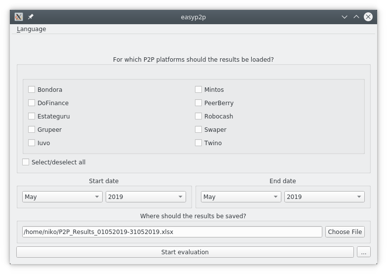
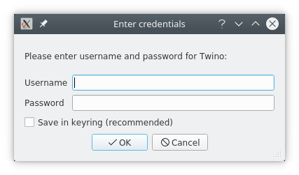
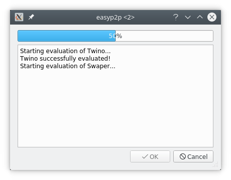

# User manual

## Main window
On start the main window of easyp2p will appear. The user interface is
(hopefully) mostly self-explanatory:

In the upper part the P2P platforms can be selected. In the field below the
date range of interest can be chosen. easyp2p only supports full months. The
results will be written to an Excel file whose location can be entered in the
next field. With the "Start evaluation" button the evaluation can
(obviously...) be started. The button with the three dots on the right will
open the settings window of easyp2p.

## Entering credentials
Before the start of the actual evaluation easyp2p will ask for credentials for
all selected P2P platforms:

Credentials can optionally be saved in the system keyring (if supported by the
system). For that purpose the "Save in keyring" checkbox must be checked. Then
credentials for this platform do not need to be entered again next time. If
credentials for all selected platforms are already saved in the keyring the
credentials window will not be shown anymore. Credentials saved in the keyring
can be changed or deleted in the settings window of easyp2p.

## Starting the evaluation
Once credentials for all platforms have been entered the progress indicator
window opens:

In this window progress is shown in form of a progress bar and short text
messages. If there should be errors during evaluation they will also be shown
in this window. As soon as evaluation is finished the window can be closed
with a click on the OK button. Evaluation can take several minutes depending
on the speed of the internet connection and the number of selected platforms.
Evaluation can be aborted any time by clicking the Cancel button.

## Settings
The settings window can be opened by clicking the button with the three dots
in the main window:

At the top the platforms are listed which are already saved in the keyring. For
those easyp2p will no longer ask for credentials. With the three buttons below
credentials for more platforms can be added and saved credentials can be
changed or deleted.

easyp2p uses ChromeDriver, a specially prepared version of the Chrome browser,
to download account statements from the P2P platforms. By default this happens
in the background, invisible to the user. If you want to watch easyp2p at work
just uncheck the ChromeDriver checkbox. Then ChromeDriver will be visible
during evaluation.

## Results
After the evaluation has finished the results will be saved to an Excel file
at the location chosen by the user in the main window. The Excel file has three
tabs: daily, monthly and total results. Accordingly the investement results are
presented on a daily and monthly basis as well as total sums for the whole
selected date range.

Not all platforms provide information necessary to fill all columns. Missing
information is marked by "N/A" to clearly distinguish it from "true" zero
values.