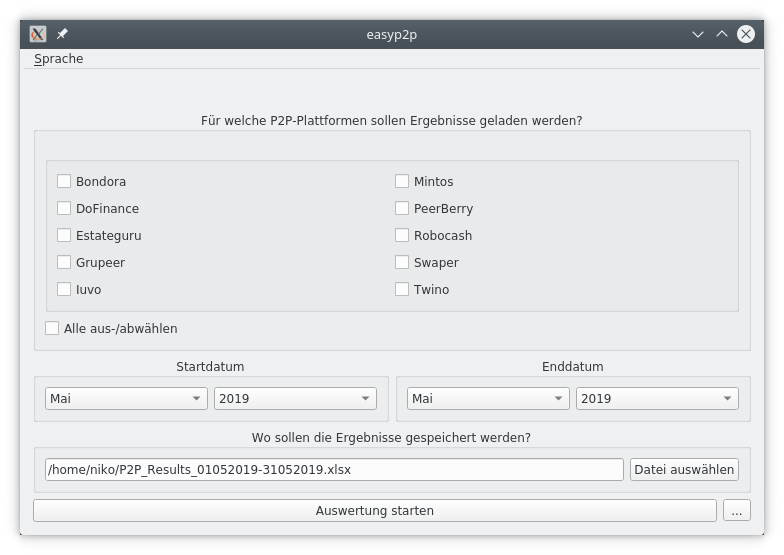
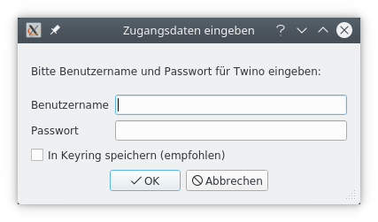
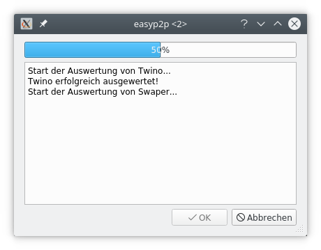
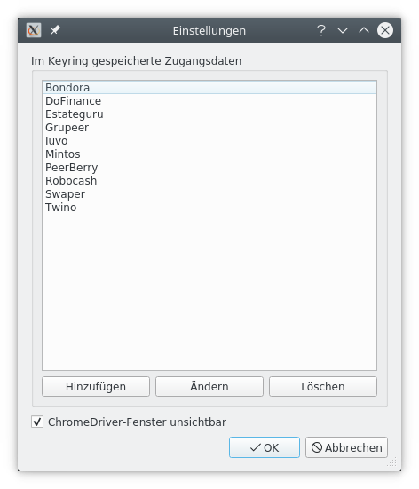

# Bedienungsanleitung

## Hauptfenster
Direkt nach dem Start landet man auf der Hauptseite von easyp2p. Die
Benutzeroberfläche ist (hoffentlich) weitgehend selbsterklärend:

Im oberen Teil können die P2P-Plattformen ausgewählt werden, für die Ergebnisse
erzeugt werden sollen. Im Feld darunter wird der Berichtszeitraum eingestellt.
easyp2p unterstützt nur volle Monate. Die Ergebnisse werden in Form einer
Excel-Arbeitsmappe ausgegeben, deren Speicherort im nächsten Feld ausgewählt
werden kann. Mit dem Button "Auswertung starten" kann die Auswertung gestartet
werden. Durch den Button mit den drei Punkten daneben gelangt zum
Einstellungsfenster.

## Zugangsdaten eingeben
Vor dem Start der eigentlichen Auswertung fragt easyp2p die Zugangsdaten für
die ausgewählten P2P-Plattformen ab:

Optional können die Zugangsdaten im System-Keyring gespeichert werden (sofern
vom System unterstützt). Dazu muss der Haken in der entsprechenden Checkbox
gesetzt werden. Dadurch müssen die Zugangsdaten für diese Plattform zukünftig
nicht mehr erneut eingegeben werden. Sind die Zugangsdaten für alle
ausgewählten Plattformen bereits im Keyring vorhanden, so entfällt die Abfrage.
Im Keyring gespeicherte Zugangsdaten können im Einstellungsfenster
aktualisiert oder gelöscht werden. 

## Auswertung starten
Nachdem alle Zugangsdaten abgefragt wurden, öffnet sich eine
Fortschrittsanzeige:

In dieser wird er aktuelle Stand der Auswertung anhand eines Fortschrittbalkens
und kurzer Textanzeigen dargestellt. Sollten während der Ausführung Fehler
auftreten werden sie ebenfalls in diesem Fenster angezeigt. Sobald die
Auswertung beendet wurde, kann das Fenster mit einem Klick auf die
OK-Schaltfläche geschlossen werden. Die Auswertung kann meherere Minuten
dauern, je nachdem wie schnell die Internetverbindung ist und wie viele
Plattformen ausgewählt wurden. Die Auswertung kann jederzeit mit einem
Klick auf "Abbrechen" abgebrochen werden.

## Einstellungen
Zum Einstellungsfenster gelangt man über den Button mit den drei Punkten unten
rechts im Hauptfenster:

Im oberen Teil sind die Plattformen aufgeführt, für die die Zugangsdaten im
Keyring gespeichert wurden. Diese werden bei erneuter Nutzung von easyp2p nicht
mehr abgefragt. Durch die drei Schaltflächen darunter können Zugangsdaten zu
fehlenden Plattformen hinzugefügt werden und gespeicherte Zugangsdaten
geändert bzw. gelöscht werden.

easyp2p nutzt ChromeDriver, eine speziell präparierte Variante des
Chrome-Browsers, um die Kontoauszugsdaten von den P2P-Plattformen
herunterzuladen. Standardmäßig passiert das unsichtbar im Hintergrund. Möchte
man easyp2p hingegen bei der Arbeit zusehen, dann kann man den Haken aus der
ChromeDriver-Checkbox entfernen. Dadurch wird ChromeDriver die Auswertung
im Vordergrund ausgeführen.

## Ergebnisse
Nach erfolgreich abgeschlossener Auswertung findet man die Ergebnisse in Form
einer Excel-Datei am Speicherort, den man im Hauptfenster ausgewählt hat.
Die Excel-Mappe hat drei Reiter: Tagesergebnisse, Monatsergebnisse und
Gesamtergebnis. Wie der Name schon sagt, sind die Ergebnisse entsprechend
auf Tagesbasis, auf Monatsbasis und als Summe über den gesamten ausgewählten
Zeitraum angegeben.

Nicht alle Plattformen stellen im Kontoauszug Informationen bereit, die für die
Befüllung aller Spalten benötigt werden. Fehlende Informationen werden durch
"N/A" gekennzeichnet, um sie von "echten" Nullwerten unterscheiden zu können.